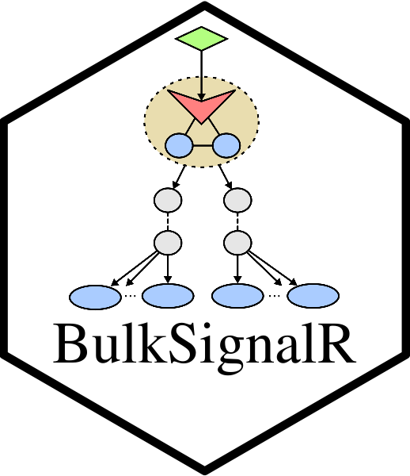
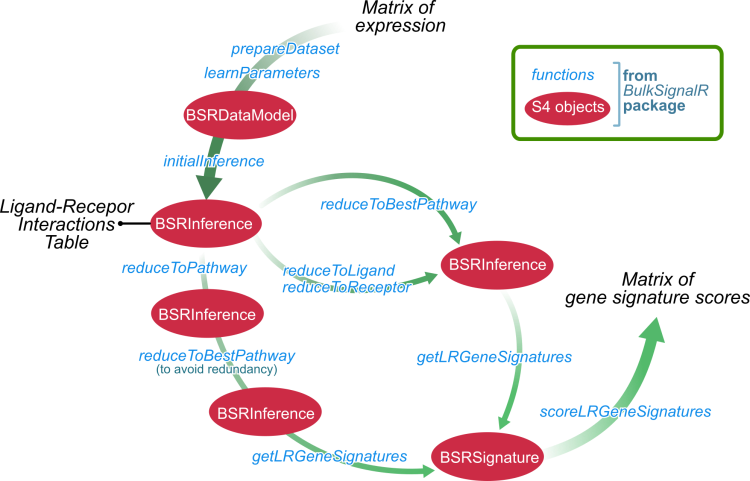

# BulkSignalR 
  

<!-- badges: start -->


<!-- badges: end -->


## Overview

**BulkSignalR** is used to infer ligand-receptor (L-R) interactions from bulk
expression (transcriptomics/proteomics) data, or spatial
transcriptomics.  

Potential L-R interactions are taken from the
LR*db* database, which was previously included in our other package 
**SingleCellSignalR**, available from Bioconductor 
[here](https://www.bioconductor.org/packages/release/bioc/html/SingleCellSignalR.html).  

Inferences rely on a statistical model linking potential
L-R interactions with biological pathways from Reactome or biological
processes from GO.  

A number of visualization and data summary functions are proposed to
help navigating the predicted interactions.



  

## Installation

``` R

# BulkSignalR directly from Bioconductor.
if (!require("BiocManager", quietly = TRUE))
    install.packages("BiocManager")
BiocManager::install("BulkSignalR")

# or Installation goes via GitHub:
# install.packages("devtools")
devtools::install_github("ZheFrench/BulkSignalR",build_vignettes = TRUE)

# To read the vignette
# browseVignettes("BulkSignalR")

```

## Notes

For a version history/change logs, see the [NEWS file](https://github.com/ZheFrench/BulksignalR/blob/master/NEWS).


**BulkSignalR** has been successfully installed on Mac OS X, Linux, and Windows using R version 4.4.


The code in this repository is published with the [CeCILL](https://github.com/ZheFrench/BulksignalR/blob/master/LICENSE.md) License.


<!-- badges: start -->
[](https://shields.io/)
<!-- badges: end -->


